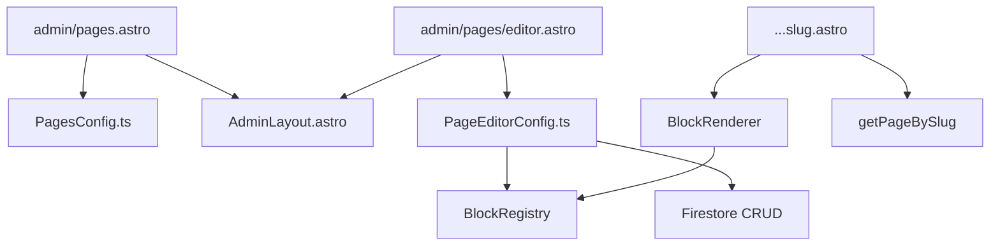

# 🔍 Revisión Profesional: Especificación del Editor de Páginas

> **Documento revisado:** `docs/wordpress-page-editor-spec.md`
> **Código analizado:** `src/pages/admin/pages.astro`, `src/pages/admin/pages/editor.astro`, `src/components/admin/PagesConfig.ts`, `src/components/admin/PageEditorConfig.ts`, `src/lib/site.ts`
> **Fecha:** Julio 2026

---

## 📊 Resumen de la Revisión

| Aspecto | Estado | Prioridad |
|---------|--------|-----------|
| Modelo de datos (`CustomPage`) | ⚠️ Gap entre spec y código actual | 🔴 Alta |
| Arquitectura Firestore (array vs subcolección) | ⚠️ Requiere decisión | 🔴 Alta |
| UI/UX del editor | ✅ Bien especificado | 🟢 Baja |
| Block Registry Pattern | ✅ Excelente | 🟢 Baja |
| Estrategia multimedia | ✅ Bien | 🟡 Media |
| Plan de fases | ⚠️ Falta detalle de migración | 🟡 Media |
| Edge Cache / Rendimiento | ✅ Bien | 🟢 Baja |
| Integración con frontend (`[...slug].astro`) | ❌ No especificado | 🔴 Alta |
| Sanitización y seguridad | ⚠️ Mencionado pero incompleto | 🟡 Media |
| Testing | ❌ No mencionado | 🟡 Media |

---

## 🔴 1. Gap Crítico: Modelo de Datos Actual vs Spec

### Estado Actual (Código)

```typescript
// src/lib/site.ts — Modelo ACTUAL
export interface CustomPage {
    id: string;
    slug: string;
    title: string;
    content: string;        // ← Texto plano, sin bloques
    published: boolean;
    showInNav: boolean;
    seoTitle?: string;
    seoDescription?: string;
    createdAt: string;
    updatedAt: string;
}
```

### Spec Propuesta (Documentación)

```typescript
// docs/wordpress-page-editor-spec.md — Modelo PROPUESTO
export interface CustomPage {
  id: string;
  slug: string;
  title: string;
  status: PageStatus;       // "published" | "draft" | "scheduled" | "private"
  excerpt?: string;
  featuredImage?: string;
  showInNav: boolean;
  order: number;
  parentPageId?: string;
  blocks: PageBlock[];      // ← Array de bloques estructurados
  seo: PageSEO;             // ← Objeto SEO anidado
  revisions?: PageRevision[];
  createdAt: string;
  updatedAt: string;
  publishedAt?: string;
}
```

### 🔴 Problemas Identificados

| # | Problema | Impacto |
|---|----------|---------|
| 1 | `content: string` → `blocks: PageBlock[]` | **Breaking change**. Todas las páginas existentes perderán su contenido si se migra directamente. |
| 2 | `published: boolean` → `status: PageStatus` | Requiere migración de datos. |
| 3 | `seoTitle`/`seoDescription` planos → `seo: PageSEO` | Cambio de estructura. |
| 4 | No existe `excerpt`, `featuredImage`, `order`, `parentPageId` | Nuevos campos. |
| 5 | No existe `revisions` | Nueva funcionalidad. |

### ✅ Sugerencia: Estrategia de Migración por Fases

```
Fase 1 (Ahora): Mantener modelo actual, añadir campos nuevos como opcionales
  └─ CustomPage extiende: { blocks?: PageBlock[], seo?: PageSEO, ... }

Fase 2 (Próxima): Migrar páginas existentes
  └─ Script de migración: content → blocks[0] (tipo "paragraph")
  └─ published → status (published | draft)

Fase 3 (Final): Deprecar campos antiguos
  └─ content, seoTitle, seoDescription quedan como legacy
  └─ Solo se usa blocks y seo
```

---

## 🔴 2. Arquitectura Firestore: Array vs Subcolección

### Situación Actual

Las páginas se guardan como **array dentro del documento `sites/{domain}`**:

```
sites/{domain}
  └── pages: CustomPage[]   ← Array en el documento principal
```

### Spec Propuesta

```
sites/{domain}
  └── pages/                    ← Subcolección
       └── {pageId}/
            ├── title, slug, status, ...
            ├── blocks: PageBlock[]
            ├── seo: PageSEO
            └── revisions/      ← Sub-subcolección
                 └── {revId}/
```

### 🔴 Análisis de Trade-offs

| Aspecto | Array (Actual) | Subcolección (Propuesta) |
|---------|---------------|--------------------------|
| **Límite 1MB** | ⚠️ Riesgo con >50 páginas o bloques ricos | ✅ Ilimitado (cada página es un doc) |
| **Lectura** | ✅ 1 read = todo el sitio | ⚠️ 1 read por página + 1 read del sitio |
| **Escritura** | ✅ 1 write = guardar todo | ⚠️ Múltiples writes |
| **Consultas** | ❌ No se puede query por slug | ✅ `where("slug", "==", slug)` |
| **Revisiones** | ❌ Inviable (reventaría el límite) | ✅ Subcolección anidada |
| **Complejidad** | ✅ Simple | ⚠️ Más código (CRUD por página) |
| **Offline** | ✅ Un solo doc para cachear | ⚠️ Múltiples docs |

### ✅ Sugerencia: Estrategia Híbrida Recomendada

```
Fase 1 (Ahora): Mantener array, pero añadir un campo pagesCount
  └─ Si pages.length > 50 → advertir al admin

Fase 2 (Migración): Crear helper que decida dónde guardar
  └─ Menos de 10 páginas simples → Array (rápido, simple)
  └─ Más de 10 páginas o con bloques → Subcolección (escalable)

Fase 3 (Unificado): Migrar todos los sitios a subcolección
  └─ Script de migración one-time
  └─ Deprecar el array
```

**Recomendación:** Implementar directamente la subcolección. El código extra es mínimo y el beneficio a largo plazo es enorme. El límite de 1MB de Firestore es real y se alcanza rápido con bloques enriquecidos.

---

## 🔴 3. Integración con el Frontend: `[...slug].astro`

### ❌ Gap Crítico

La spec menciona un archivo `src/pages/[...slug].astro` que **no existe en el código actual**. Actualmente no hay una ruta dinámica que renderice las páginas personalizadas.

### Estado Actual

```
src/pages/
  ├── index.astro          ← Home (usa PublicLayout)
  ├── 404.astro            ← Página no encontrada
  └── admin/               ← Panel admin
```

### Lo que Falta

```
src/pages/
  └── [...slug].astro      ← Ruta dinámica para páginas personalizadas
```

### ✅ Sugerencia: Especificación para `[...slug].astro`

```astro
---
// src/pages/[...slug].astro — Ruta dinámica para páginas personalizadas
import PublicLayout from "../components/public/PublicLayout.astro";
import BlockRenderer from "../components/public/BlockRenderer.astro";
import { getSiteData } from "../lib/site";
import { getPageBySlug } from "../lib/site";

export async function getStaticPaths() {
  // En build estático, generar paths para todas las páginas publicadas
  // En SSR, esto no es necesario
  return [];
}

const slug = Astro.params.slug;
const domain = getEffectiveDomain(Astro.request);
const siteData = await getSiteData(domain);
const page = await getPageBySlug(domain, slug);

if (!page || page.status !== "published") {
  return Astro.redirect("/404");
}
---

<PublicLayout siteData={siteData}>
  <article>
    <h1>{page.title}</h1>
    {page.featuredImage && }
    <BlockRenderer blocks={page.blocks} />
  </article>
</PublicLayout>
```

### Funciones Necesarias en `src/lib/site.ts`

```typescript
// Para subcolección:
export async function getPageBySlug(domain: string, slug: string): Promise<CustomPage | null> {
  const q = query(
    collection(db, "sites", domain, "pages"),
    where("slug", "==", slug),
    where("status", "==", "published"),
    limit(1)
  );
  const snapshot = await getDocs(q);
  if (snapshot.empty) return null;
  return { id: snapshot.docs[0].id, ...snapshot.docs[0].data() } as CustomPage;
}

// Para array (actual):
export async function getPageBySlugFromArray(siteData: SiteData, slug: string): Promise<CustomPage | null> {
  return siteData.pages?.find(p => p.slug === slug && p.published) || null;
}
```

---

## 🟡 4. Mejoras al Modelo de Datos Propuesto

### 4.1 Añadir `pageType` para páginas especiales

```typescript
export interface CustomPage {
  // ...campos existentes...
  pageType?: "standard" | "landing" | "blog" | "contact";  // ← NUEVO
  // ...
}
```

**Beneficio:** Permite tratamientos especiales (ej: landing page sin navbar, contacto con formulario).

### 4.2 Añadir `template` para layouts alternativos

```typescript
export interface CustomPage {
  // ...campos existentes...
  template?: "default" | "full-width" | "sidebar-left" | "sidebar-right" | "blank";  // ← NUEVO
  // ...
}
```

**Beneficio:** El usuario puede elegir el layout de cada página individualmente.

### 4.3 Añadir `password` para páginas protegidas

```typescript
export interface CustomPage {
  // ...campos existentes...
  password?: string;  // ← NUEVO (opcional, páginas protegidas)
  // ...
}
```

**Beneficio:** Funcionalidad profesional (páginas privadas con contraseña).

---

## 🟡 5. Block Registry: Mejoras al Patrón

### 5.1 Versión Actual (Spec)

```typescript
export class BlockRegistry {
  private static blocks = new Map<string, BlockDefinition>();
  public static register(def: BlockDefinition) { ... }
  public static render(block: PageBlock): string { ... }
}
```

### 5.2 Versión Mejorada

```typescript
export interface BlockDefinition {
  type: BlockType;
  label: string;
  icon: string;
  defaultContent: Record<string, any>;
  defaultStyle?: BlockStyle;
  render: (content: any, style: BlockStyle) => string;
  // ← NUEVOS CAMPOS
  inspectorFields?: InspectorField[];  // Campos dinámicos para el inspector lateral
  validate?: (content: any) => string | null;  // Validación del contenido
  sanitize?: (content: any) => any;  // Sanitización específica del bloque
}

export interface InspectorField {
  key: string;
  label: string;
  type: "text" | "color" | "number" | "select" | "image" | "textarea" | "toggle";
  options?: { label: string; value: string }[];  // Para type: "select"
  defaultValue?: any;
  placeholder?: string;
  section: "content" | "style" | "advanced";
}

export class BlockRegistry {
  private static blocks = new Map<string, BlockDefinition>();
  private static initialized = false;

  public static register(def: BlockDefinition) {
    this.blocks.set(def.type, def);
  }

  public static get(type: BlockType): BlockDefinition | undefined {
    return this.blocks.get(type);
  }

  public static getAll(): BlockDefinition[] {
    return Array.from(this.blocks.values());
  }

  public static render(block: PageBlock): string {
    const def = this.blocks.get(block.type);
    if (!def) return `<div class="block-error">Bloque desconocido: ${block.type}</div>`;
    return def.render(block.content, block.style || {});
  }

  public static getInspectorFields(type: BlockType): InspectorField[] {
    return this.blocks.get(type)?.inspectorFields || [];
  }

  public static validate(block: PageBlock): string | null {
    const def = this.blocks.get(block.type);
    if (!def) return "Tipo de bloque desconocido";
    if (def.validate) return def.validate(block.content);
    return null;
  }

  public static sanitize(block: PageBlock): PageBlock {
    const def = this.blocks.get(block.type);
    if (!def || !def.sanitize) return block;
    return { ...block, content: def.sanitize(block.content) };
  }
}
```

**Beneficio:** El inspector lateral se vuelve 100% dinámico. Cada bloque define sus propios campos de configuración.

---

## 🟡 6. Sanitización y Seguridad

### Estado Actual

El proyecto ya tiene `src/lib/sanitizer.ts` con:
- `sanitizeUrl()` — Previene XSS en URLs
- `escapeAttribute()` — Escapa atributos HTML
- `sanitizeText()` — Limpia textos
- `slugify()` — Genera slugs
- `sanitizeSiteData()` — Sanitiza objetos completos

### ✅ Mejoras Necesarias para el Editor

```typescript
// Añadir a src/lib/sanitizer.ts

/**
 * Sanitiza el contenido de un bloque según su tipo.
 */
export function sanitizeBlockContent(type: BlockType, content: Record<string, any>): Record<string, any> {
  const sanitized = { ...content };
  
  for (const [key, value] of Object.entries(sanitized)) {
    if (typeof value === "string") {
      if (key === "url" || key === "src" || key === "href") {
        sanitized[key] = sanitizeUrl(value);
      } else if (key === "html" || key === "code") {
        sanitized[key] = sanitizeHtml(value);  // Solo HTML seguro
      } else {
        sanitized[key] = sanitizeText(value);
      }
    }
  }
  
  return sanitized;
}

/**
 * Sanitiza HTML permitiendo solo etiquetas seguras.
 */
export function sanitizeHtml(html: string): string {
  // Usar DOMPurify en cliente, o una regex básica en servidor
  // Por ahora, escapar etiquetas peligrosas
  return html
    .replace(/<script\b[^<]*(?:(?!<\/script>)<[^<]*)*<\/script>/gi, "")
    .replace(/on\w+="[^"]*"/gi, "")
    .replace(/on\w+='[^']*'/gi, "");
}

/**
 * Valida que un slug sea seguro.
 */
export function isValidSlug(slug: string): boolean {
  return /^[a-z0-9-]+$/.test(slug) && slug.length > 0 && slug.length <= 200;
}
```

---

## 🟡 7. Testing: Especificación de Pruebas

### 7.1 Tests Unitarios para el Block Registry

```typescript
// tests/block-registry.test.ts
import { describe, it, expect } from "vitest";
import { BlockRegistry } from "../src/lib/blocks/registry";

describe("BlockRegistry", () => {
  it("should register a block definition", () => {
    BlockRegistry.register({
      type: "heading",
      label: "Heading",
      icon: "H",
      defaultContent: { text: "Hello", level: 2 },
      render: (content) => `<h${content.level}>${content.text}</h${content.level}>`,
    });
    expect(BlockRegistry.get("heading")).toBeDefined();
  });

  it("should render a block by type", () => {
    const html = BlockRegistry.render({
      id: "1",
      type: "heading",
      content: { text: "Test", level: 2 },
    });
    expect(html).toBe("<h2>Test</h2>");
  });

  it("should return empty string for unknown block type", () => {
    const html = BlockRegistry.render({
      id: "1",
      type: "unknown" as any,
      content: {},
    });
    expect(html).toContain("Bloque desconocido");
  });
});
```

### 7.2 Tests de Integración para PageEditorConfig

```typescript
// tests/page-editor.test.ts
import { describe, it, expect } from "vitest";
import { slugify, sanitizeBlockContent } from "../src/lib/sanitizer";

describe("Page Editor - slugify", () => {
  it("should convert title to slug", () => {
    expect(slugify("Acerca de Nosotros")).toBe("acerca-de-nosotros");
  });
  it("should remove special characters", () => {
    expect(slugify("¡Hola! ¿Cómo estás?")).toBe("hola-como-estas");
  });
  it("should handle empty input", () => {
    expect(slugify("")).toBe("");
  });
});

describe("Page Editor - block sanitization", () => {
  it("should sanitize URLs in block content", () => {
    const result = sanitizeBlockContent("image", {
      url: "javascript:alert('xss')",
      alt: "test",
    });
    expect(result.url).toBe("#");
  });
});
```

### 7.3 Tests de Frontend para BlockRenderer

```typescript
// tests/block-renderer.test.ts
import { describe, it, expect } from "vitest";

// Simular el renderizado de bloques
function renderBlock(type: string, content: any): string {
  switch (type) {
    case "heading":
      return `<h${content.level || 2}>${content.text}</h${content.level || 2}>`;
    case "paragraph":
      return `<p>${content.text}</p>`;
    case "image":
      return ``;
    default:
      return "";
  }
}

describe("BlockRenderer", () => {
  it("should render heading block", () => {
    expect(renderBlock("heading", { text: "Title", level: 1 })).toBe("<h1>Title</h1>");
  });
  it("should render paragraph block", () => {
    expect(renderBlock("paragraph", { text: "Hello" })).toBe("<p>Hello</p>");
  });
  it("should render image block with alt text", () => {
    const html = renderBlock("image", { url: "https://example.com/img.jpg", alt: "Photo" });
    expect(html).toContain('src="https://example.com/img.jpg"');
    expect(html).toContain('alt="Photo"');
  });
});
```

---

## 🟡 8. Plan de Fases Mejorado

### Fase 0: Preparación (Antes de tocar código)

- [ ] Decidir: ¿Array o subcolección? (Recomendación: subcolección directa)
- [ ] Definir el modelo de datos final (congelar interfaz `CustomPage`)
- [ ] Crear el archivo `[...slug].astro` con ruta dinámica
- [ ] Escribir tests del BlockRegistry antes de implementar

### Fase 1: Modelo de Datos y Firestore

- [ ] Actualizar `CustomPage` en `src/lib/site.ts` con nuevos campos (opcionales)
- [ ] Crear funciones CRUD para subcolección `sites/{domain}/pages/{pageId}`
- [ ] Migrar páginas existentes (array → subcolección)
- [ ] Tests de integración con Firestore (mock)

### Fase 2: Block Registry

- [ ] Crear `src/lib/blocks/registry.ts` con BlockRegistry
- [ ] Registrar bloques básicos: heading, paragraph, image
- [ ] Tests unitarios del registry

### Fase 3: Editor UI (3 columnas)

- [ ] Rediseñar `editor.astro` con layout de 3 columnas
- [ ] Implementar Block Inserter (panel izquierdo)
- [ ] Implementar Canvas WYSIWYG (centro)
- [ ] Implementar Inspector lateral (derecha)
- [ ] Implementar Drag & Drop para reordenar bloques

### Fase 4: Block Renderer (Frontend)

- [ ] Crear `src/components/public/BlockRenderer.astro`
- [ ] Implementar `[...slug].astro` con ruta dinámica
- [ ] Tests de renderizado de bloques

### Fase 5: Features Avanzadas

- [ ] Autosave (localStorage + Firestore)
- [ ] Historial de revisiones (Undo/Redo)
- [ ] Preview responsivo (Desktop/Tablet/Mobile)
- [ ] SEO Health Score en tiempo real

---

## 🟢 9. Mejoras Menores (Calidad de Vida)

### 9.1 Añadir `docs/` navigation

Crear un `docs/README.md` que indexe todos los documentos:

```markdown
# Documentación del Proyecto

- `wordpress-page-editor-spec.md` — Especificación del Editor de Páginas
- `admin-profile-users-strategy.md` — Estrategia de Perfil y Usuarios
- `REVIEW-wordpress-page-editor-spec.md` — Revisión de la especificación
```

### 9.2 Añadir diagrama de arquitectura

Incluir un diagrama Mermaid que muestre la relación entre todos los componentes:



### 9.3 Añadir convención de nombres para bloques

```typescript
// Convención para nombres de bloque
// Formato: kebab-case, en inglés
// Prefijo opcional para categoría: text-, media-, layout-, widget-

type BlockType = 
  | "text-heading"      // Encabezados H1-H6
  | "text-paragraph"    // Párrafo
  | "text-list"         // Listas
  | "text-quote"        // Citas
  | "media-image"       // Imagen simple
  | "media-gallery"     // Galería de imágenes
  | "media-video"       // Video embebido
  | "layout-hero"       // Banner Hero
  | "layout-columns"    // Columnas / Grid
  | "layout-cards"      // Tarjetas
  | "layout-spacer"     // Espaciador
  | "widget-cta"        // Llamada a la acción
  | "widget-html"       // HTML personalizado
  | "widget-buttons";   // Botones
```

---

## 📋 Checklist de Acciones Recomendadas

### 🔴 Alta Prioridad (Hacer antes de implementar)

- [ ] Decidir: ¿Array o subcolección en Firestore?
- [ ] Definir el modelo `CustomPage` final (congelar interfaz)
- [ ] Crear `src/pages/[...slug].astro` con ruta dinámica
- [ ] Definir estrategia de migración de páginas existentes

### 🟡 Media Prioridad (Durante implementación)

- [ ] Implementar BlockRegistry con inspectorFields
- [ ] Añadir sanitizeBlockContent() a sanitizer.ts
- [ ] Escribir tests unitarios del BlockRegistry
- [ ] Escribir tests de integración del editor
- [ ] Añadir pageType y template al modelo

### 🟢 Baja Prioridad (Mejoras futuras)

- [ ] Añadir docs/README.md con índice
- [ ] Añadir diagrama Mermaid de arquitectura
- [ ] Implementar páginas protegidas con contraseña
- [ ] Implementar SEO Health Score

---

## 💡 Resumen de Recomendaciones Clave

1. **Subcolección desde el inicio** — El límite de 1MB de Firestore es real. Implementar subcolección ahora ahorrará una migración dolorosa después.

2. **Migración progresiva del modelo** — No romper páginas existentes. Añadir campos nuevos como opcionales (`blocks?`, `seo?`) y migrar gradualmente.

3. **`[...slug].astro` es crítico** — Sin la ruta dinámica, las páginas personalizadas no se renderizan en el frontend. Debería ser la primera prioridad después de definir el modelo.

4. **BlockRegistry con inspectorFields** — Hacer que cada bloque defina sus propios campos del inspector lateral hace que añadir nuevos bloques sea trivial y no requiera modificar el núcleo del editor.

5. **Tests primero** — El BlockRegistry y el BlockRenderer son funciones puras, perfectas para testear con Vitest antes de implementar la UI.
