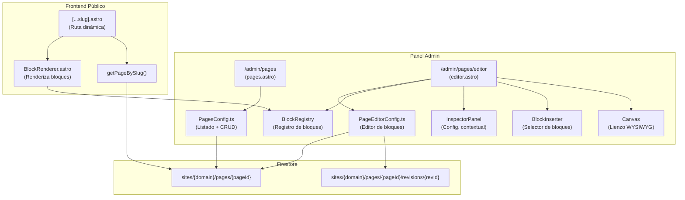

# 📄 Documentación Técnica: Admin Pages — Editor de Páginas Profesional

> **Versión:** 1.0
> **Fecha:** Julio 2026
> **Estado:** En documentación
> **Documentos relacionados:**
> - `docs/wordpress-page-editor-spec.md` — Spec original del Block Editor
> - `docs/REVIEW-wordpress-page-editor-spec.md` — Review y mejoras propuestas
> - `docs/admin-profile-users-strategy.md` — Estrategia de Perfil y Usuarios

---

## 📑 Índice

1. [Visión General](#1-visión-general)
2. [Arquitectura del Sistema](#2-arquitectura-del-sistema)
3. [Modelo de Datos](#3-modelo-de-datos)
4. [Estructura de Archivos](#4-estructura-de-archivos)
5. [Flujo de Trabajo del Editor](#5-flujo-de-trabajo-del-editor)
6. [Block Registry](#6-block-registry)
7. [Firestore: Subcolección de Páginas](#7-firestore-subcolección-de-páginas)
8. [Renderizado Frontend](#8-renderizado-frontend)
9. [Plan de Implementación por Fases](#9-plan-de-implementación-por-fases)
10. [Testing](#10-testing)
11. [Checklist de Implementación](#11-checklist-de-implementación)

---

## 1. Visión General

### 1.1 ¿Qué estamos construyendo?

Un **Editor de Páginas profesional estilo WordPress** que permite a los usuarios del panel admin crear y editar páginas personalizadas para su sitio web mediante un sistema de **bloques modulares** (Block Editor).

### 1.2 Objetivos

| Objetivo | Descripción |
|----------|-------------|
| **UX Profesional** | Interfaz de 3 columnas similar a WordPress/Gutenberg |
| **Escalable** | Block Registry que permite añadir bloques sin modificar el núcleo |
| **Rendimiento** | Subcolección Firestore para evitar límite de 1MB |
| **SEO Ready** | Inspector con meta-títulos, descripciones y OpenGraph |
| **Responsive** | Preview en Desktop, Tablet y Mobile desde el editor |

### 1.3 Usuarios y Permisos

| Rol | Acceso al editor |
|-----|-----------------|
| **Admin** (owner) | Crear, editar, publicar, eliminar cualquier página |
| **Editor** | Crear y editar páginas (no puede publicar ni eliminar) |
| **Viewer** | Solo lectura del listado, no puede editar |

---

## 2. Arquitectura del Sistema

### 2.1 Diagrama de Componentes



### 2.2 Layout del Editor (3 Columnas)

```
┌──────────────────────────────────────────────────────────────────────────────┐
│ TOPBAR                                                                       │
│ [← Volver]  [📄 Título de página]  [💻 📱 📱]  [↩️ ↪️]  [👁️ Preview]  [💾 Guardar] │
├────────────┬─────────────────────────────────────────────────┬───────────────┤
│ BLOCK      │  CANVAS DE EDICIÓN (WYSIWYG)                    │ INSPECTOR     │
│ INSERTER   │                                                 │ LATERAL       │
│            │  ┌───────────────────────────────────────────┐   │               │
│ ▸ Texto    │  │ [Bloque: Encabezado H2]                  │   │ ⚙️ PÁGINA     │
│   Heading  │  │ # Acerca de Nosotros                     │   │  • Slug       │
│   Párrafo  │  └───────────────────────────────────────────┘   │  • Estado     │
│   Lista    │  ┌───────────────────────────────────────────┐   │  • Imagen Dest│
│ ▸ Medios   │  │ [Bloque: Párrafo]                        │   │  • Nav        │
│   Imagen   │  │  Somos una empresa dedicada a...         │   │               │
│   Galería  │  └───────────────────────────────────────────┘   │ 🎨 BLOQUE     │
│ ▸ Layout   │  ┌───────────────────────────────────────────┐   │  • Tipografía │
│   Hero     │  │ [Bloque: Imagen]                          │   │  • Colores    │
│   Columnas │  │  🖼️ [equipo.jpg]                          │   │  • Márgenes   │
│   CTA      │  └───────────────────────────────────────────┘   │  • Alineación │
│            │                                                 │               │
│            │  ┌───────────────────────────────────────────┐   │ 🔍 SEO        │
│            │  │ [➕ Añadir bloque]                         │   │  • Meta Title │
│            │  └───────────────────────────────────────────┘   │  • Meta Desc  │
└────────────┴─────────────────────────────────────────────────┴───────────────┘
```

### 2.3 Componentes del Layout

#### TopBar
| Elemento | Comportamiento |
|----------|---------------|
| `← Volver` | Navega a `/admin/pages` (con confirmación si hay cambios sin guardar) |
| Título | Editable inline, actualiza el `<h1>` del documento |
| 💻📱📱 | Simulador responsivo: cambia el ancho del canvas (100% / 768px / 375px) |
| ↩️↪️ | Undo/Redo (Ctrl+Z / Ctrl+Y) con pila en memoria |
| 👁️ Preview | Abre `/{slug}` en nueva pestaña (solo si está guardado) |
| 💾 Guardar | Guarda en Firestore, cambia a "Guardando..." y luego "✓ Guardado" |
| Estado | Indicador: "Borrador", "Publicado", "Guardando...", "Cambios sin guardar" |

#### Block Inserter (Panel Izquierdo)
- Lista categorizada de bloques disponibles
- Al hacer clic en un bloque, se añade al final del canvas
- Búsqueda/filtro de bloques por nombre
- Colapsable para dar más espacio al canvas

#### Canvas (Centro)
- Lienzo WYSIWYG que aplica los estilos del tema del sitio
- Cada bloque es un "card" con bordes sutiles en modo edición
- Al hacer clic en un bloque → se selecciona (borde azul) y se abre el inspector
- Toolbar flotante sobre el bloque seleccionado: ⬆️ ⬇️ ✏️ ❌
- Drag & Drop para reordenar bloques
- Estado vacío: "Comienza añadiendo un bloque desde el panel izquierdo"

#### Inspector Lateral (Panel Derecho)
- **Pestaña Página**: Slug, Estado (published/draft/private), Featured Image, Show in Nav, Excerpt
- **Pestaña Bloque**: Campos dinámicos según el tipo de bloque seleccionado
- **Pestaña SEO**: Meta Title, Meta Description, OG Image, No Index toggle
- Colapsable para dar más espacio al canvas

---

## 3. Modelo de Datos

### 3.1 Interfaz `CustomPage` (Versión Final)

```typescript
// ============================================
// src/lib/site.ts — Tipos del Editor de Páginas
// ============================================

export type PageStatus = "published" | "draft" | "private";

export interface CustomPage {
  id: string;
  slug: string;
  title: string;
  status: PageStatus;
  excerpt?: string;
  featuredImage?: string;
  showInNav: boolean;
  order: number;
  parentPageId?: string;
  pageType?: "standard" | "landing" | "contact";
  template?: "default" | "full-width" | "blank";
  password?: string;

  // Sistema de bloques
  blocks: PageBlock[];

  // SEO
  seo: PageSEO;

  // Metadatos
  createdAt: string;
  updatedAt: string;
  publishedAt?: string;
  createdBy?: string;
  updatedBy?: string;
}
```

### 3.2 Interfaz `PageBlock`

```typescript
export type BlockType =
  | "text-heading"
  | "text-paragraph"
  | "text-list"
  | "text-quote"
  | "media-image"
  | "media-gallery"
  | "media-video"
  | "layout-hero"
  | "layout-columns"
  | "layout-cards"
  | "layout-spacer"
  | "widget-cta"
  | "widget-html"
  | "widget-buttons";

export interface PageBlock {
  id: string;
  type: BlockType;
  content: Record<string, any>;
  style?: BlockStyle;
}

export interface BlockStyle {
  textColor?: string;
  backgroundColor?: string;
  paddingY?: number;
  paddingX?: number;
  marginTop?: number;
  marginBottom?: number;
  textAlign?: "left" | "center" | "right" | "justify";
  fullWidth?: boolean;
  borderRadius?: number;
  customClass?: string;
}
```

### 3.3 Interfaz `PageSEO`

```typescript
export interface PageSEO {
  metaTitle?: string;
  metaDescription?: string;
  focusKeywords?: string[];
  ogTitle?: string;
  ogDescription?: string;
  ogImage?: string;
  noIndex?: boolean;
}
```

### 3.4 Interfaz `PageRevision`

```typescript
export interface PageRevision {
  id: string;
  timestamp: string;
  authorEmail?: string;
  title: string;
  blocksSnapshot: PageBlock[];
}
```

### 3.5 Migración desde el Modelo Actual

El modelo actual en `src/lib/site.ts` usa:

```typescript
// MODELO ACTUAL (a migrar)
export interface CustomPage {
  id: string;
  slug: string;
  title: string;
  content: string;        // ← Texto plano
  published: boolean;      // ← Booleano
  showInNav: boolean;
  seoTitle?: string;       // ← Campos planos
  seoDescription?: string;
  createdAt: string;
  updatedAt: string;
}
```

**Estrategia de migración:**

```
Fase 1: Añadir campos nuevos como opcionales
  └─ CustomPage se extiende: { blocks?: PageBlock[], seo?: PageSEO, status?: PageStatus }

Fase 2: Migrar páginas existentes (script one-time)
  └─ content → blocks[0] = { type: "text-paragraph", content: { text: content } }
  └─ published → status = published | draft
  └─ seoTitle/seoDescription → seo.metaTitle/seo.metaDescription

Fase 3: Deprecar campos antiguos
  └─ content, seoTitle, seoDescription se ignoran en el editor nuevo
  └─ El BlockRenderer solo lee blocks[]
```

---

## 4. Estructura de Archivos

### 4.1 Archivos Existentes (Ya creados)

| Archivo | Propósito | Estado |
|---------|-----------|--------|
| `src/pages/admin/pages.astro` | Listado de páginas con modal de eliminación | ✅ Creado |
| `src/pages/admin/pages/editor.astro` | Editor de páginas (formulario básico) | ✅ Creado |
| `src/components/admin/PagesConfig.ts` | Lógica del listado (CRUD sobre array) | ✅ Creado |
| `src/components/admin/PageEditorConfig.ts` | Lógica del editor actual | ✅ Creado |
| `src/lib/site.ts` | Interfaz CustomPage + getSiteData | ✅ Creado |

### 4.2 Archivos a Crear

| Archivo | Propósito | Prioridad |
|---------|-----------|-----------|
| `src/lib/blocks/registry.ts` | BlockRegistry + BlockDefinition | 🔴 Alta |
| `src/lib/blocks/definitions.ts` | Registro de todos los bloques disponibles | 🔴 Alta |
| `src/lib/blocks/renderer.ts` | Funciones de renderizado de cada bloque | 🔴 Alta |
| `src/components/public/BlockRenderer.astro` | Componente Astro que renderiza bloques | 🔴 Alta |
| `src/pages/[...slug].astro` | Ruta dinámica para páginas personalizadas | 🔴 Alta |
| `src/lib/pages.ts` | Funciones CRUD para subcolección pages | 🔴 Alta |
| `src/components/admin/BlockInserter.ts` | Panel izquierdo de inserción de bloques | 🟡 Media |
| `src/components/admin/EditorCanvas.ts` | Lienzo WYSIWYG central | 🟡 Media |
| `src/components/admin/InspectorPanel.ts` | Panel derecho de configuración contextual | 🟡 Media |
| `src/components/admin/BlockToolbar.ts` | Toolbar flotante sobre bloque seleccionado | 🟡 Media |
| `src/styles/editor.css` | Estilos específicos del editor | 🟡 Media |

### 4.3 Archivos a Modificar

| Archivo | Cambio | Prioridad |
|---------|--------|-----------|
| `src/lib/site.ts` | Actualizar interfaz CustomPage (versión final) | 🔴 Alta |
| `src/components/admin/PagesConfig.ts` | Migrar de array a subcolección | 🔴 Alta |
| `src/components/admin/PageEditorConfig.ts` | Reescribir para usar BlockRegistry | 🔴 Alta |
| `src/pages/admin/pages/editor.astro` | Rediseñar con layout de 3 columnas | 🔴 Alta |
| `src/components/admin/AdminLayout.astro` | Añadir enlace "Páginas" si no existe | 🟡 Media |
| `src/lib/i18n/modules/admin.ts` | Añadir traducciones del editor | 🟡 Media |
| `src/styles/admin.css` | Añadir estilos del editor | 🟡 Media |

---

## 5. Flujo de Trabajo del Editor

### 5.1 Crear una Página Nueva

```
1. Usuario hace clic en "+ Crear nueva página" en /admin/pages
2. Navega a /admin/pages/editor (sin ?id=)
3. El editor muestra:
   ├─ Título vacío con placeholder "Título de la página"
   ├─ Canvas vacío con mensaje "Comienza añadiendo un bloque"
   └─ Inspector con valores por defecto
4. Usuario escribe el título → slug se autogenera
5. Usuario añade bloques desde el Block Inserter
6. Usuario hace clic en "Guardar"
7. Se crea el documento en Firestore: sites/{domain}/pages/{newPageId}
8. Se redirige a /admin/pages/editor?id={newPageId} (modo edición)
```

### 5.2 Editar una Página Existente

```
1. Usuario hace clic en ✏️ en una página del listado
2. Navega a /admin/pages/editor?id={pageId}
3. El editor carga:
   ├─ Título, slug, estado desde Firestore
   ├─ Canvas con los bloques existentes
   └─ Inspector con valores guardados
4. Usuario modifica bloques (añadir, editar, reordenar, eliminar)
5. Usuario hace clic en "Guardar"
6. Se actualiza el documento en Firestore
7. Se crea una revisión en la subcolección revisions
```

### 5.3 Guardado (Save Flow)

```
1. Usuario hace clic en "Guardar" o Ctrl+S
2. Validación:
   ├─ Título no vacío
   ├─ Slug no vacío y formato válido
   ├─ Slug único (no duplicado en otras páginas)
   └─ Contenido de bloques válido (según cada BlockDefinition.validate)
3. Sanitización:
   ├─ sanitizeBlockContent() en cada bloque
   ├─ sanitizeUrl() en URLs
   └─ sanitizeText() en textos
4. Escritura en Firestore:
   ├─ updateDocument("sites", domain, { pages/updatedPages })
   │   (si usamos array) 
   │   O
   ├─ setDocument("sites", domain, "pages", pageId, pageData)
   │   (si usamos subcolección)
5. Crear revisión (opcional):
   └─ setDocument("sites", domain, "pages", pageId, "revisions", revId, { ... })
6. Feedback visual: "✓ Página guardada correctamente"
```

### 5.4 Eliminar una Página

```
1. Usuario hace clic en 🗑️ en el listado
2. Modal de confirmación: "¿Eliminar {title}? Esta acción no se puede deshacer."
3. Usuario confirma
4. Se elimina el documento de Firestore
5. Se elimina el navLink correspondiente (si showInNav era true)
6. Se actualiza el listado
```

---

## 6. Block Registry

### 6.1 Arquitectura

```
src/lib/blocks/
  ├── registry.ts        ← BlockRegistry (singleton)
  ├── definitions.ts     ← Registro de todos los bloques
  └── renderer.ts        ← Funciones de renderizado HTML
```

### 6.2 BlockRegistry (registry.ts)

```typescript
// ============================================
// BlockRegistry — Registro Modular de Bloques
// ============================================
// Patrón Registry (SOLID Open/Closed):
// - Cada bloque se registra independientemente
// - Añadir nuevos bloques no requiere modificar el núcleo
// - El inspector lateral se genera automáticamente
// ============================================

export interface InspectorField {
  key: string;
  label: string;
  type: "text" | "color" | "number" | "select" | "image" | "textarea" | "toggle";
  options?: { label: string; value: string }[];
  defaultValue?: any;
  placeholder?: string;
  section: "content" | "style" | "advanced";
}

export interface BlockDefinition {
  type: BlockType;
  label: string;
  icon: string;
  category: "text" | "media" | "layout" | "widget";
  defaultContent: Record<string, any>;
  defaultStyle?: BlockStyle;
  inspectorFields?: InspectorField[];
  render: (content: any, style: BlockStyle) => string;
  validate?: (content: any) => string | null;
  sanitize?: (content: any) => any;
}

export class BlockRegistry {
  private static blocks = new Map<string, BlockDefinition>();

  static register(def: BlockDefinition): void {
    this.blocks.set(def.type, def);
  }

  static get(type: BlockType): BlockDefinition | undefined {
    return this.blocks.get(type);
  }

  static getAll(): BlockDefinition[] {
    return Array.from(this.blocks.values());
  }

  static getByCategory(category: string): BlockDefinition[] {
    return this.getAll().filter(b => b.category === category);
  }

  static render(block: PageBlock): string {
    const def = this.blocks.get(block.type);
    if (!def) return `<div class="block-error">⚠️ Bloque desconocido: ${block.type}</div>`;
    return def.render(block.content, block.style || {});
  }

  static getInspectorFields(type: BlockType): InspectorField[] {
    return this.blocks.get(type)?.inspectorFields || [];
  }

  static validate(block: PageBlock): string | null {
    const def = this.blocks.get(block.type);
    if (!def) return "Tipo de bloque desconocido";
    if (def.validate) return def.validate(block.content);
    return null;
  }

  static sanitize(block: PageBlock): PageBlock {
    const def = this.blocks.get(block.type);
    if (!def || !def.sanitize) return block;
    return { ...block, content: def.sanitize(block.content) };
  }

  static createDefault(type: BlockType): PageBlock {
    const def = this.blocks.get(type);
    return {
      id: `block-${Date.now()}-${Math.random().toString(36).substring(2, 7)}`,
      type,
      content: def?.defaultContent || {},
      style: def?.defaultStyle,
    };
  }
}
```

### 6.3 Bloques a Registrar (definitions.ts)

| Bloque | Tipo | Categoría | Content |
|--------|------|-----------|---------|
| **Encabezado** | `text-heading` | text | `{ text: string, level: 1-6 }` |
| **Párrafo** | `text-paragraph` | text | `{ text: string }` |
| **Lista** | `text-list` | text | `{ items: string[], ordered: boolean }` |
| **Cita** | `text-quote` | text | `{ text: string, author?: string }` |
| **Imagen** | `media-image` | media | `{ url: string, alt: string, caption?: string }` |
| **Galería** | `media-gallery` | media | `{ images: { url: string, alt: string }[] }` |
| **Video** | `media-video` | media | `{ url: string, provider: "youtube" | "vimeo" | "custom" }` |
| **Hero** | `layout-hero` | layout | `{ title: string, subtitle: string, backgroundImage: string, ctaText: string, ctaLink: string }` |
| **Columnas** | `layout-columns` | layout | `{ columns: number, blocks: PageBlock[][] }` |
| **Tarjetas** | `layout-cards` | layout | `{ cards: { title: string, text: string, image: string }[] }` |
| **Espaciador** | `layout-spacer` | layout | `{ height: number }` |
| **CTA** | `widget-cta` | widget | `{ text: string, buttonText: string, buttonLink: string }` |
| **HTML** | `widget-html` | widget | `{ html: string }` |
| **Botones** | `widget-buttons` | widget | `{ buttons: { text: string, url: string, style: string }[] }` |

### 6.4 Ejemplo de Registro de un Bloque

```typescript
// definitions.ts
BlockRegistry.register({
  type: "text-heading",
  label: "Encabezado",
  icon: "H",
  category: "text",
  defaultContent: { text: "Título", level: 2 },
  defaultStyle: { textColor: "#1a1a1a", marginBottom: 16 },
  inspectorFields: [
    { key: "text", label: "Texto", type: "text", section: "content", placeholder: "Escribe el encabezado" },
    { key: "level", label: "Nivel", type: "select", section: "content",
      options: [
        { label: "H1", value: "1" },
        { label: "H2", value: "2" },
        { label: "H3", value: "3" },
      ],
      defaultValue: "2"
    },
    { key: "textColor", label: "Color de texto", type: "color", section: "style", defaultValue: "#1a1a1a" },
    { key: "textAlign", label: "Alineación", type: "select", section: "style",
      options: [
        { label: "Izquierda", value: "left" },
        { label: "Centro", value: "center" },
        { label: "Derecha", value: "right" },
      ]
    },
  ],
  render: (content, style) => {
    const level = content.level || 2;
    const align = style?.textAlign ? ` style="text-align: ${style.textAlign}"` : "";
    return `<h${level}${align}>${escapeHtml(content.text || "")}</h${level}>`;
  },
  validate: (content) => {
    if (!content.text || content.text.trim() === "") return "El texto del encabezado no puede estar vacío";
    return null;
  },
  sanitize: (content) => ({
    ...content,
    text: sanitizeText(content.text),
  }),
});
```

---

## 7. Firestore: Subcolección de Páginas

### 7.1 Estructura en Firestore

```
FIRESTORE
└── sites/{domain}/
    ├── siteName, locale, theme, navLinks, ...
    │
    └── pages/                          ← SUBCOLECCIÓN
        └── {pageId}/
            ├── id: "page-abc123"
            ├── slug: "acerca-de"
            ├── title: "Acerca de Nosotros"
            ├── status: "published"
            ├── showInNav: true
            ├── order: 2
            ├── blocks: [ { type: "text-heading", ... }, { type: "text-paragraph", ... } ]
            ├── seo: { metaTitle: "...", metaDescription: "..." }
            ├── createdAt: "2026-07-22T..."
            ├── updatedAt: "2026-07-22T..."
            │
            └── revisions/              ← SUB-SUBCOLECCIÓN
                └── {revId}/
                    ├── id: "rev-1719000000"
                    ├── timestamp: "2026-07-22T..."
                    ├── authorEmail: "user@example.com"
                    ├── title: "Acerca de Nosotros"
                    └── blocksSnapshot: [ ... ]
```

### 7.2 Funciones CRUD (src/lib/pages.ts)

```typescript
// ============================================
// pages.ts — CRUD para subcolección de páginas
// ============================================

import { collection, doc, getDoc, getDocs, setDoc, deleteDoc, query, where, orderBy, limit } from "firebase/firestore";
import { db } from "./firebase";
import type { CustomPage, PageRevision } from "./site";

const PAGES_COLLECTION = (domain: string) => `sites/${domain}/pages`;
const REVISIONS_COLLECTION = (domain: string, pageId: string) => `sites/${domain}/pages/${pageId}/revisions`;

// --- READ ---

export async function getPageById(domain: string, pageId: string): Promise<CustomPage | null> {
  const docRef = doc(db, PAGES_COLLECTION(domain), pageId);
  const snap = await getDoc(docRef);
  if (!snap.exists()) return null;
  return { id: snap.id, ...snap.data() } as CustomPage;
}

export async function getPageBySlug(domain: string, slug: string): Promise<CustomPage | null> {
  const q = query(
    collection(db, PAGES_COLLECTION(domain)),
    where("slug", "==", slug),
    limit(1)
  );
  const snapshot = await getDocs(q);
  if (snapshot.empty) return null;
  const doc = snapshot.docs[0];
  return { id: doc.id, ...doc.data() } as CustomPage;
}

export async function getAllPages(domain: string): Promise<CustomPage[]> {
  const q = query(
    collection(db, PAGES_COLLECTION(domain)),
    orderBy("order", "asc")
  );
  const snapshot = await getDocs(q);
  return snapshot.docs.map(doc => ({ id: doc.id, ...doc.data() } as CustomPage));
}

// --- WRITE ---

export async function createPage(domain: string, page: CustomPage): Promise<boolean> {
  try {
    await setDoc(doc(db, PAGES_COLLECTION(domain), page.id), page);
    return true;
  } catch (err) {
    console.error("Error creating page:", err);
    return false;
  }
}

export async function updatePage(domain: string, pageId: string, data: Partial<CustomPage>): Promise<boolean> {
  try {
    await setDoc(doc(db, PAGES_COLLECTION(domain), pageId), data, { merge: true });
    return true;
  } catch (err) {
    console.error("Error updating page:", err);
    return false;
  }
}

export async function deletePage(domain: string, pageId: string): Promise<boolean> {
  try {
    await deleteDoc(doc(db, PAGES_COLLECTION(domain), pageId));
    return true;
  } catch (err) {
    console.error("Error deleting page:", err);
    return false;
  }
}

// --- REVISIONS ---

export async function createRevision(domain: string, pageId: string, revision: PageRevision): Promise<boolean> {
  try {
    await setDoc(doc(db, REVISIONS_COLLECTION(domain, pageId), revision.id), revision);
    return true;
  } catch (err) {
    console.error("Error creating revision:", err);
    return false;
  }
}

export async function getRevisions(domain: string, pageId: string): Promise<PageRevision[]> {
  const q = query(
    collection(db, REVISIONS_COLLECTION(domain, pageId)),
    orderBy("timestamp", "desc"),
    limit(50)
  );
  const snapshot = await getDocs(q);
  return snapshot.docs.map(doc => doc.data() as PageRevision);
}
```

### 7.3 Migración desde Array a Subcolección

Para no romper las páginas existentes, se implementa un **adaptador temporal**:

```typescript
// Adaptador: soporta tanto array como subcolección
export async function getPage(domain: string, slug: string, siteData?: SiteData): Promise<CustomPage | null> {
  // 1. Intentar subcolección (nuevo sistema)
  const page = await getPageBySlug(domain, slug);
  if (page) return page;

  // 2. Fallback: buscar en array del documento principal (sistema antiguo)
  if (siteData?.pages) {
    const oldPage = siteData.pages.find(p => p.slug === slug && p.published);
    if (oldPage) {
      // Migrar automáticamente a subcolección
      const migratedPage = migrateOldPage(oldPage);
      await createPage(domain, migratedPage);
      return migratedPage;
    }
  }

  return null;
}

function migrateOldPage(oldPage: any): CustomPage {
  return {
    id: oldPage.id,
    slug: oldPage.slug,
    title: oldPage.title,
    status: oldPage.published ? "published" : "draft",
    showInNav: oldPage.showInNav || false,
    order: 0,
    blocks: oldPage.content
      ? [{ id: `block-migrated-${Date.now()}`, type: "text-paragraph", content: { text: oldPage.content } }]
      : [],
    seo: {
      metaTitle: oldPage.seoTitle || "",
      metaDescription: oldPage.seoDescription || "",
    },
    createdAt: oldPage.createdAt,
    updatedAt: oldPage.updatedAt,
  };
}
```

---

## 8. Renderizado Frontend

### 8.1 Ruta Dinámica: `[...slug].astro`

```astro
---
// src/pages/[...slug].astro — Ruta dinámica para páginas personalizadas
// ============================================
// Captura cualquier ruta que no sea /, /admin/*, o /404
// Busca la página en Firestore por slug y la renderiza
// ============================================

import PublicLayout from "../components/public/PublicLayout.astro";
import BlockRenderer from "../components/public/BlockRenderer.astro";
import { getSiteData, getPageBySlug } from "../lib/site";
import { getEffectiveDomain } from "../lib/domain-check";

// En SSR, no necesitamos getStaticPaths
const domain = getEffectiveDomain(Astro.request);
const siteData = await getSiteData(domain);
const slug = Astro.params.slug;

// Buscar la página (primero subcolección, luego array legacy)
const page = await getPageBySlug(domain, slug);

// Si no existe o no está publicada → 404
if (!page || page.status !== "published") {
  return Astro.redirect("/404", 302);
}
---

<PublicLayout siteData={siteData} pageTitle={page.seo?.metaTitle || page.title} pageDescription={page.seo?.metaDescription}>
  <main class="dynamic-page">
    <article class="page-content" data-page-id={page.id}>
      {page.featuredImage && (
        <div class="page-featured-image">
          
        </div>
      )}

      <BlockRenderer blocks={page.blocks} />
    </article>
  </main>
</PublicLayout>

<style>
  .dynamic-page {
    max-width: var(--content-width, 1200px);
    margin: 0 auto;
    padding: 2rem 1rem;
  }

  .page-featured-image {
    margin-bottom: 2rem;
    border-radius: 8px;
    overflow: hidden;
  }

  .page-featured-image img {
    width: 100%;
    height: auto;
    max-height: 400px;
    object-fit: cover;
  }
</style>
```

### 8.2 BlockRenderer.astro

```astro
---
// src/components/public/BlockRenderer.astro
// ============================================
// Renderiza un array de bloques en HTML
// Usa BlockRegistry para delegar el renderizado
// ============================================

import type { PageBlock } from "../../lib/site";
import { BlockRegistry } from "../../lib/blocks/registry";

export interface Props {
  blocks: PageBlock[];
}

const { blocks = [] } = Astro.props;
---

{
  blocks.map((block) => {
    const html = BlockRegistry.render(block);
    const styleAttr = block.style
      ? `style="${buildInlineStyle(block.style)}"`
      : "";

    return (
      <div class={`block block-${block.type}`} data-block-id={block.id} {styleAttr}>
