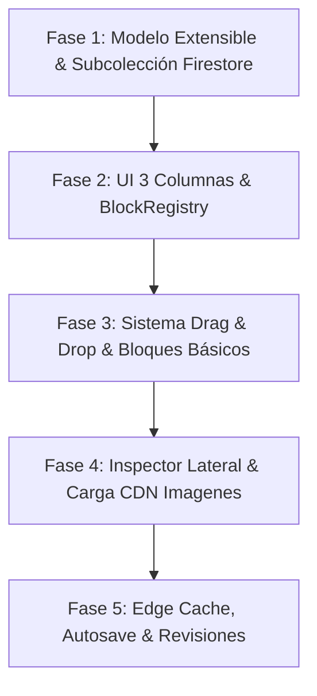

# Especificación Técnica: Editor de Páginas Profesional Estilo WordPress (Block Editor)

> **Documento de Arquitectura, Almacenamiento en Firebase, Renderizado Frontend y Escalabilidad**
> Este documento define la especificación completa para transformar la sección de creación/edición de páginas en un **Editor de Bloques profesional, responsivo y ultra completo**, detallando la arquitectura de datos en Firebase, la estrategia de multimedia, el renderizado dinámico en el frontend y los patrones de **alta escalabilidad**.

---

## 📐 1. Arquitectura General y Layout UI/UX

El editor se estructura en una **interfaz de 3 columnas responsiva** diseñada para maximizar el espacio de trabajo en vivo (WYSIWYG) y ofrecer controles contextuales avanzados.

```
┌────────────────────────────────────────────────────────────────────────────────────────┐
│ TOPBAR: [← Volver]  [Página: Acerca de...]  [💻 📱 📱]  [Deshacer/Rehacer]  [👁️] [Guardar]│
├───────────────┬────────────────────────────────────────────────────────┬───────────────┤
│ BLOQUES       │ CANVAS DE EDICIÓN EN VIVO                              │ INSPECTOR     │
│ (Inserter)    │ (Lienzo interactivo WYSIWYG)                           │ LATERAL       │
│               │                                                        │ (Página/Bloque)│
│ + Texto       │ ┌────────────────────────────────────────────────────┐ │               │
│ + Imagen      │ │ [Bloque Encabezado]                                │ │ ⚙️ PÁGINA     │
│ + Hero        │ │ # Acerca de Nuestra Empresa                        │ │  • Permalink  │
│ + Galería     │ └────────────────────────────────────────────────────┘ │  • Estado     │
│ + Columnas    │ ┌────────────────────────────────────────────────────┐ │  • Imagen Dest│
│ + CTA         │ │ [Bloque Hero]                                      │ │  • Menú Nav   │
│ + Tarjetas    │ │  Bienvenido a nuestra visión...                    │ │               │
│               │ └────────────────────────────────────────────────────┘ │ 🎨 BLOQUE     │
│               │ ┌────────────────────────────────────────────────────┐ │  • Tipografía │
│               │ │ [Bloque Texto / Imagen]                            │ │  • Colores    │
│               │ └────────────────────────────────────────────────────┘ │  • Márgenes   │
└───────────────┴────────────────────────────────────────────────────────┴───────────────┘
```

### Componentes Principales del Layout

1. **Barra Superior (Top Header Bar)**:
   - Botón de retorno al listado (`← Volver a Páginas`).
   - Título e indicador de estado del documento (*Borrador guardado*, *Guardando...*).
   - **Simulador de Dispositivos (Responsive Switcher)**: Botones para alternar el ancho del lienzo entre **Escritorio (100%)**, **Tablet (768px)** y **Móvil (375px)**.
   - Historial de cambios: Botones **Deshacer (Undo)** y **Rehacer (Redo)**.
   - Botón **Vista Previa** (abre la página en una pestaña independiente).
   - Botón Principal **Guardar Borrador / Publicar**.
   - Toggle para ocultar/mostrar el Inspector Lateral Derecho.

2. **Panel de Inserción de Bloques (Left Block Inserter)**:
   - Menú desplegable o lateral colapsable categorizado:
     - **Texto**: Encabezados (H1-H6), Párrafos, Citas (Blockquote), Listas.
     - **Medios**: Imagen única, Galería de imágenes, Video embebido.
     - **Diseño & Estructura**: Banner Hero, Columnas (Grid), Tarjetas (Feature Cards), Llamada a la Acción (CTA Box), Espaciador.
     - **Avanzado**: Código HTML personalizado, Botones aislados.

3. **Lienzo Principal de Edición (Central Editing Canvas)**:
   - Lienzo WYSIWYG que aplica los estilos globales del tema del sitio.
   - Edición de texto inline al hacer clic directo en cualquier bloque.
   - Barra de herramientas flotante sobre el bloque activo (mover arriba/abajo, duplicar, eliminar, cambiar alineación).
   - Arrastrar y soltar (Drag & Drop) para reordenar bloques de forma intuitiva.

4. **Inspector Lateral Derecho (Contextual Settings Sidebar)**:
   - **Pestaña 1: Página (Page Settings)**:
     - *URL / Permalink*: Slug editable con validación en tiempo real.
     - *Estado y Visibilidad*: Publicada, Borrador, Programada, Privada.
     - *Imagen Destacada (Featured Image)*: Carga y selector de imagen principal para tarjetas y metas social.
     - *Extracto / Breve Resumen*: Texto para listas y motores de búsqueda.
     - *Navegación*: Toggle para incluir/excluir del menú principal del sitio y orden relativo.
   - **Pestaña 2: Bloque (Block Settings)**:
     - Ajustes dinámicos que cambian según el bloque seleccionado (Tipografía, Colores de texto/fondo, Relleno/Margen, Bordes, Sombras).
   - **Pestaña 3: SEO & Social (Yoast Style Inspector)**:
     - Vista previa del snippet de Google.
     - Título Meta y Descripción SEO con barra de longitud recomendada.
     - Imagen OpenGraph para redes sociales.

---

## 🗄️ 2. Modelo de Datos Extensible (`CustomPage` & `PageBlock`)

```typescript
// ============================================
// Tipos del Editor Estilo WordPress
// ============================================

export type PageStatus = "published" | "draft" | "scheduled" | "private";

export interface CustomPage {
  id: string;
  slug: string;
  title: string;
  status: PageStatus;
  excerpt?: string;
  featuredImage?: string;
  showInNav: boolean;
  order: number;
  parentPageId?: string;
  
  // Lista modular de bloques
  blocks: PageBlock[];

  // Configuración SEO y Social
  seo: PageSEO;

  // Historial de revisiones
  revisions?: PageRevision[];

  createdAt: string;
  updatedAt: string;
  publishedAt?: string;
}

export type BlockType = 
  | "heading" 
  | "paragraph" 
  | "hero" 
  | "image" 
  | "gallery" 
  | "cards" 
  | "cta" 
  | "columns" 
  | "html" 
  | "spacer";

export interface PageBlock {
  id: string;
  type: BlockType;
  content: Record<string, any>;
  style?: BlockStyle;
}

export interface BlockStyle {
  textColor?: string;
  backgroundColor?: string;
  paddingY?: number; // en px
  paddingX?: number;
  marginTop?: number;
  marginBottom?: number;
  textAlign?: "left" | "center" | "right" | "justify";
  fullWidth?: boolean;
  borderRadius?: number;
  customClass?: string;
}

export interface PageSEO {
  metaTitle?: string;
  metaDescription?: string;
  focusKeywords?: string[];
  ogTitle?: string;
  ogDescription?: string;
  ogImage?: string;
  noIndex?: boolean;
}

export interface PageRevision {
  id: string;
  timestamp: string;
  authorEmail?: string;
  title: string;
  blocksSnapshot: PageBlock[];
}
```

---

## 🔥 3. Estrategia de Almacenamiento en Firebase & Multimedia

Para garantizar rendimiento óptimo, escalabilidad y tiempos de respuesta ultra rápidos, la información se organiza en **Firestore** y los archivos multimedia en **Firebase Storage / Cloudflare R2**.

```
FIREBASE DATA ARCHITECTURE
┌────────────────────────────────────────────────────────────────────────┐
│ FIRESTORE COLLECTION: "sites"                                          │
│  └── Document: "midominio.com"                                         │
│       ├── siteName, locale, theme, navLinks, socialLinks               │
│       │                                                                │
│       └── SUBCOLLECTION: "pages"                                       │
│            └── Document: "page-acerca-de"                             │
│                 ├── id: "page-acerca-de"                               │
│                 ├── slug: "acerca-de"                                  │
│                 ├── status: "published"                                │
│                 ├── featuredImage: "https://storage.../featured.jpg"   │
│                 ├── blocks: [ {type: "hero", ...}, {type: "text"} ]    │
│                 ├── seo: { metaTitle: "...", metaDescription: "..." } │
│                 │                                                      │
│                 └── SUBCOLLECTION: "revisions"                         │
│                      └── Doc: "rev-1719000000"                         │
│                           └── blocksSnapshot: [...]                    │
└────────────────────────────────────────────────────────────────────────┘

FIREBASE STORAGE / R2 BUCKET
┌────────────────────────────────────────────────────────────────────────┐
│ PATH: /sites/{domain}/pages/{pageId}/{timestamp}_{filename}             │
│  ├── /sites/midominio.com/pages/page-acerca-de/1719000-hero.jpg        │
│  └── /sites/midominio.com/pages/page-acerca-de/1719001-gallery-1.jpg  │
└────────────────────────────────────────────────────────────────────────┘
```

### 3.1 Estructura en Firestore: Subcolección `sites/{domain}/pages`
* **¿Por qué Subcolección en lugar de un Array?**:
  * Un único documento de Firestore tiene un límite de **1 MB**. Un sitio web con muchas páginas o bloques enriquecidos superaría este límite si todo se guardara en un solo array dentro del documento principal `sites/{domain}`.
  * Con la subcolección `sites/{domain}/pages/{pageId}`, cada página vive de forma independiente, permitiendo consultas ultrarrápidas por slug (`where("slug", "==", currentSlug)`) y un historial de revisiones sin afectar el tamaño del sitio.

### 3.2 Almacenamiento de Multimedia (Imágenes y Archivos)
* Las imágenes cargadas en el bloque `image`, `hero`, `gallery` o `featuredImage` se envían a **Firebase Storage / R2** bajo la ruta estructurada `/sites/{domain}/pages/{pageId}/`.
* La función de subida devuelve una **URL pública CDN HTTPS** permanente.
* En el JSON del bloque solo se guarda la URL de CDN limpia (`content.url: "https://..."`), asegurando que las transferencias en Firestore sean ligeras y de pocos kilobytes.

---

## 💻 4. Arquitectura de Carga y Renderizado Dinámico en el Frontend

```
              PETICIÓN DEL USUARIO: GET /acerca-de
                                │
                                ▼
           ┌──────────────────────────────────────────┐
           │     src/pages/[...slug].astro            │
           └────────────────────┬─────────────────────┘
                                │
          1. Obtener dominio actual (getEffectiveDomain)
          2. Buscar página por slug (getPageBySlug)
                                │
                                ▼
           ┌──────────────────────────────────────────┐
           │     FIRESTORE: sites/domain/pages        │
           │     WHERE slug == "acerca-de"            │
           │     AND status == "published"            │
           └────────────────────┬─────────────────────┘
                                │
              ¿Existe y está publicada?
             ├── NO ──► Renderizar 404.astro
             └── SÍ
                  │
                  ▼
   ┌─────────────────────────────────────────────────────────────┐
   │ 1. Inyectar SEO en <head>: title, metaDescription, ogImage  │
   │ 2. Cargar Barra de Navegación del Sitio (navLinks)          │
   │ 3. Pasar 'blocks' al Componente <BlockRenderer blocks={...}>│
   └──────────────────────────────┬──────────────────────────────┘
                                  │
                                  ▼
   ┌─────────────────────────────────────────────────────────────┐
   │              COMPONENT: <BlockRenderer>                     │
   │ Iterar sobre blocks[] y renderizar según block.type         │
   └─────────────────────────────────────────────────────────────┘
```

---

## 🚀 5. Estrategia de Ultra-Escalabilidad y Alto Rendimiento

Para soportar miles de sitios activos, millones de lecturas diarias y la adición continua de nuevos tipos de bloques sin degradar el rendimiento, aplicamos **5 patrones de ingeniería de alta escalabilidad**:

### 5.1 Registro Extensible de Bloques (Block Registry Pattern - SOLID Open/Closed)
En lugar de depender de una instrucción `switch` gigante hardcodeada, el sistema utiliza un **Registro Modular de Bloques (`BlockRegistry`)**. Cada bloque es un módulo desacoplado que registra su renderizado y sus controles de inspector:

```typescript
export interface BlockDefinition {
  type: BlockType;
  label: string;
  icon: string;
  defaultContent: Record<string, any>;
  render: (content: any, style: BlockStyle) => string;
}

export class BlockRegistry {
  private static blocks = new Map<string, BlockDefinition>();

  public static register(def: BlockDefinition) {
    this.blocks.set(def.type, def);
  }

  public static render(block: PageBlock): string {
    const def = this.blocks.get(block.type);
    if (!def) return '';
    return def.render(block.content, block.style || {});
  }
}
```
* **Beneficio de Escalabilidad**: Permite agregar 50+ bloques nuevos o extensiones de terceros sin modificar ni una sola línea del núcleo del editor ni del renderizador.

### 5.2 Capa de Caché en el Edge (Edge Caching / SWR)
- **Stale-While-Revalidate (SWR)** en Cloudflare Edge / Workers:
  - Las peticiones públicas a páginas se sirven desde la caché global CDN con latencia de ~10ms y **costo $0 en lecturas de Firestore**.
  - Al guardar o publicar una página en el panel admin, se emite una invalidación de tag de caché (`purgeTag("site:domain:page:slug")`), asegurando actualización instantánea sin sobrecargar la base de datos.

### 5.3 Optimización de Imágenes y Responsive Srcset
- Al subir una imagen a Firebase Storage / R2, una Cloud Function o proceso en segundo plano genera automáticamente variantes optimizadas en formato **WebP / AVIF** en anchos clave (375w, 768w, 1200w).
- El bloque genera etiquetas `<picture>` con `srcset`, `loading="lazy"` y `decoding="async"`, garantizando puntuaciones **Core Web Vitals de 95-100 en Google PageSpeed**.

### 5.4 Desensamblado y Carga Diferida (Lazy Loading de Bloques Pesados)
- Componentes de contenido complejo (ej. galerías con Lightbox, reproductores de video embebidos, sliders) cargan sus scripts JS client-side mediante `intersectionObserver` únicamente cuando el usuario desplaza la pantalla hasta dicho bloque.

### 5.5 Rendimiento del Editor para Páginas Extensas (100+ Bloques)
- **Debounced Updates**: La sincronización de estado del texto enriquecido utiliza un *debounce* de 300ms para evitar re-renderizados innecesarios mientras el usuario escribe velozmente.
- **Batching de Guardado**: Los auto-guardados utilizan escrituras en lote (batching) en Firestore para reducir consumo de cuota de operaciones I/O.

---

## ⚡ 6. Funcionalidades Profesionales Estilo WordPress

### 6.1 Auto-Guardado (Autosave)
- Guardado automático en `localStorage` cada 15 segundos con notificación discreta en la TopBar.

### 6.2 Historial de Revisiones (Undo/Redo & Revisions)
- Control de pila en memoria (`Ctrl + Z` / `Ctrl + Y`) y subcolección de revisiones en Firestore con opción de restaurar versiones anteriores.

### 6.3 Previsualización Responsiva (Responsive Viewport Mode)
- Conmutador en vivo para simular la vista en Escritorio, Tablet (768px) y Móvil (375px).

### 6.4 Analizador SEO en Tiempo Real (SEO Health Score)
- Evaluación en tiempo real de palabras clave, longitud de título y meta descripción con semáforo visual (Verde, Amarillo, Rojo).

---

## 🗺️ 7. Hoja de Ruta / Plan de Fases de Desarrollo



1. **Fase 1**: Definición de `CustomPage`, `PageBlock`, `BlockRegistry` y funciones de subcolección Firestore `sites/{domain}/pages` en `src/lib/site.ts`.
2. **Fase 2**: Maquetación del layout de 3 columnas en `/admin/pages/editor.astro`.
3. **Fase 3**: Controlador `PageEditorConfig.ts` e interactividad de bloques (agregar, reordenar con drag & drop, editar inline, eliminar).
4. **Fase 4**: Subida de imágenes con generación de URLs CDN, Inspector Lateral y `BlockRenderer` en `[...slug].astro`.
5. **Fase 5**: Autosave en localStorage, simulador responsivo, caché edge e historial de revisiones.
